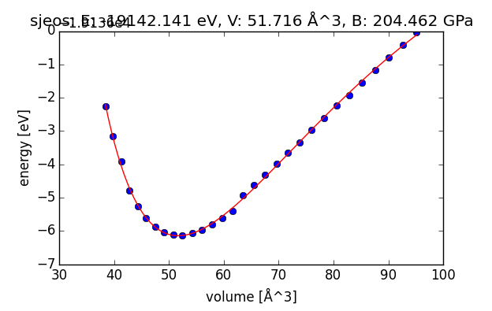
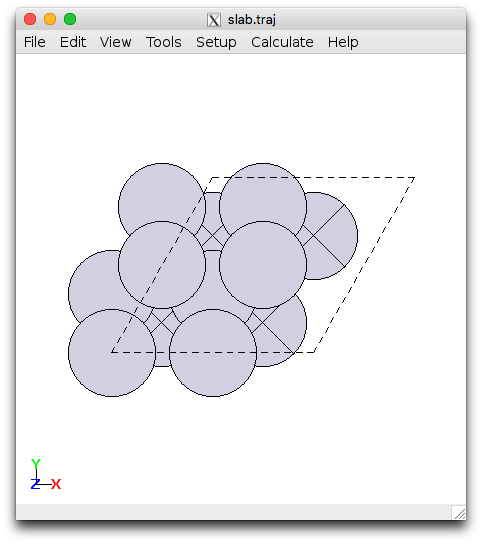
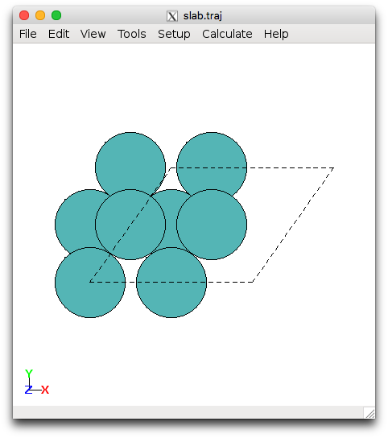
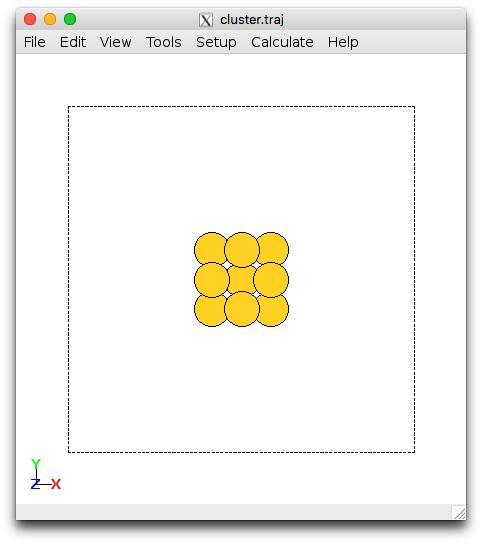

# ASE Tutorials
1. [Introduction to ASE](../)
2. [Getting Started](../Getting_Started/)
3. [Adsorption](../Adsorption/)
4. [Transition States](../Transition_States/)
5. [Error Estimation and Density of States](../BEEF_DOS/)

____

## Getting Started ##

In the first exercise, we will be looking at bulk metals and how to determine lattice constants, then we will be setting up metal surfaces and metal clusters. The example scripts use Pt by default. You should change this to the system you have been assigned for the project so you can start making progress.

## Contents ##

1. [A Typical ASE Script](#a-typical-ase-script)
2. [Bulk metal](#bulk)
  1. [Lattice Constant Determination](#lattice-constant-determination)
  2. [Convergence with k-Points](#convergence-with-k-points)
3. [Setting up Surfaces](#surfaces)
4. [Setting up Clusters](#clusters)
5. [Restarting Calculations](#restarting)
6. [Next Steps](#next)

### Required Files ###

Obtain the required files by running:

on Sherlock:

```bash
cd $SCRATCH
wget http://chemeng444.github.io/ASE/Getting_Started/exercise_1_sherlock.tar
tar -xvf exercise_1_sherlock.tar
```

or on CEES:

```bash
cd ~/$USER
wget http://chemeng444.github.io/ASE/Getting_Started/exercise_1_cees.tar
tar -xvf exercise_1_cees.tar
```

This should create a folder called `Exercise_1_Getting_Started/` containing subfolders with all the starter scripts you will need. By default, The output for your calculations will be written into the folder from where you submitted the script. To perform new calculations, you will generally be copying the scripts from these tutorials into new folders, modifying them, and submitting them.

<a name='a-typical-ase-script'></a>

### A Typical ASE Script ###

ASE scripts can be run directly in the terminal (in the login node) or submitting to external nodes. Generally, you will be submitting jobs to external nodes and only small scripts will be run on the login node. By default, all output from any submitted script will be written *from the directory where the submission command was executed*, so make sure you are inside the calculation folder before running the submission command.

Let's look at how a typical ASE script is written. Open the [`run_surf.py`](run_surf.py) script in the `Surface` folder. We will be showing the Sherlock versions of the script for brevity, but the CEES versions are analogous.

```bash
vi run_surf.py
```

The first line,

```python
#!/usr/bin/env /home/vossj/suncat/bin/python
```

will ensure that the version of Python that is being used is the one that has all the software from SUNCAT installed.

Next, notice the comments in the beginning. These lines will be ignored by Python, but will be read by the job submission system. These include information such as how much time to allocate, the number of nodes required, what the names of the output and error files are, what the name of the job should be, and what your email is. Most of the settings will be the same regardless of the job you submit. You will mostly just be changing the amount of allocated time and the number of nodes, for jobs that require parallelization (not required for this project).

```python
#above line selects special python interpreter needed to run espresso
#SBATCH -p iric 
#set a job name
#SBATCH --job-name=myjob

#a file for job output, you can check job progress
#SBATCH --output=myjob.out

# a file for errors from the job
#SBATCH --error=myjob.err

#time you think you need. The max is 2880:00
#SBATCH --time=100:00

#number of nodes you are requesting
#SBATCH --nodes=1

#SBATCH --mem-per-cpu=4000

#get emailed about job BEGIN, END, and FAIL
#SBATCH --mail-type=ALL

#who to send email to; please change to your email
#SBATCH  --mail-user=SUNETID@stanford.edu

#task to run per node; each node has 16 cores
#SBATCH --ntasks-per-node=16
```

To change the allocated time for the jobs, modify:

Sherlock (MM:SS):

```python
#SBATCH --time=1200:00
```

CEES (HH:MM:SS):

```python
#PBS -l walltime=20:00:00
```


Next, we import all the relevant ASE modules in for this calculation

```python
from ase import *
from ase.lattice.surface import *
from ase.optimize import *
from ase.constraints import *
from espresso import espresso
```

The asterisks `*` indicates that all methods and classes should be imported. You can also specify the ones you need. `from ase import *` imports all the basic functionality in ase, `from ase.lattice.surface import *` import methods and classes related to solid surfaces, `from ase.optimize import *` imports the optimization methods, `from ase.constraints import *` imports the constraint methods, and most importantly `from espresso import espresso` import the Quantum ESPRESSO calculator for the ASE interface.

We define a string

```python
name = 'Pt111'
```
which we can easily modify and use for naming output files.

An existing trajectory can be read in:

```python
# read in the slab
slab = io.read('slab.traj')
```


Then, the Quantum ESPRESSO calculator is set up. All parameters related to the electronic structure calculation are included here. The following example shows typical parameters that we use in the group for metal calculations. Typically, the number of k-points is determined using 24 Å per lattice vector for transition metals.

```python
#espresso calculator setup
calc = espresso(pw=500,           #plane-wave cutoff
                dw=5000,          #density cutoff
                xc='BEEF-vdW',    #exchange-correlation functional
                kpts=(4,4,1),     #k-point sampling, no dispersion to be sampled along z
                nbands=-10,       #10 extra bands besides the bands needed to hold the valence electrons
                sigma=0.1,
                convergence= {'energy':1e-5,  #convergence parameters
                              'mixing':0.1,
                              'nmix':10,
                              'mix':4,
                              'maxsteps':500,
                              'diag':'david'
                             },
                outdir='calcdir') #output directory for Quantum Espresso files
```

Then, atomic constraints are set. Since there are only a finite number of layers in the slab, the lowest layers are fixed to emulate the bulk. 

```python
mask = [atom.z < 10 for atom in slab]  #atoms in the structure to be fixed
fixatoms = FixAtoms(mask=mask)
slab.set_constraint(fixatoms)           #fix everything but the top layer atoms
slab.rattle()                           #define random displacements to the atomic positions before optimization
```

Finally, the Quantum ESPRESSO calculator is attached to the `slab` Atoms object, and the optimizer is defined. 

To perform structural optimizations, an optimizer needs to be defined. We will be using the BFGS Line Search, which is implemented in `QuasiNewton`. For more details about optimizations in ASE, look at [this page](https://wiki.fysik.dtu.dk/ase/ase/optimize.html). `QuasiNewton()` is an object for the [structural optimization](https://wiki.fysik.dtu.dk/ase/ase/optimize.html), which takes an Atoms object as an input. A convergence criteria is set and `qn.run()` initiates the optimization.

```python
slab.set_calculator(calc)                       #connect espresso to slab
qn = QuasiNewton(slab, trajectory=name+'.traj', logfile=name+'.log') #relax slab
qn.run(fmax=0.05)                               #until max force<=0.05 eV/AA
```

The `logfile=` argument is optional. If it's not specified, then the output will be written to the system output, e.g. `myjob.out`. If it is specified, then the output for the optimization will be written to `name+'.log'`, e.g. `Pt111.log`. You should see the following results:

```bash
BFGSLineSearch:   0[  0]  12:50:46   -28144.460970       1.7496
BFGSLineSearch:   1[  1]  12:59:45   -28145.528706       0.4792
BFGSLineSearch:   2[  2]  13:07:35   -28145.571393       0.3625
BFGSLineSearch:   3[  3]  13:14:49   -28145.600615       0.1408
BFGSLineSearch:   4[  4]  13:21:30   -28145.608312       0.0994
BFGSLineSearch:   5[  5]  13:27:02   -28145.610934       0.0540
BFGSLineSearch:   6[  6]  13:31:28   -28145.611948       0.0245
```

The column names for the results are:

```bash
optimizer         step    time       total energy (eV)   forces (eV/Å)
```

The trajectory for all optimization steps are stored in `name+'.traj'`, so if `name='output'`, then it will be stored in `output.traj`. You can read the output trajectory using `ase-gui output.traj` and view all steps. The final energy is also stored in the `.traj` file and can be retrieved by reading in the `.traj` file. Using Python in interactive mode (i.e., by running `python`):

```python
>>> from ase.io import read
>>> atoms = read('output.traj')
>>> atoms.get_potential_energy()
-28436.147150825487
```


<a name='bulk'></a>

### Bulk Metal ###

Head into the `Exercise_1_Getting_Started/Bulk/` folder.

As a first example, we will be setting up a bulk fcc metal. You will typically do this when working with an entirely new system. 

<a name='lattice-constant-determination'></a>

#### Lattice Constant Determination ####

Find the [`bulk_metal.py`](bulk_metal.py) script in the `lattice` folder. This script determines the optimum lattice parameter for bulk fcc Pt using the equation of state model. **Change Pt into the metal you have been assigned for the project** and also look up a reasonable initial guess for the lattice parameter, then replace `a = `. There's actually a table of calculated lattice parameters below, but one would typically start out with an experimentally measured value as a starting guess. For alloys, an A<sub>3</sub>B alloy will be generated. **Note:** we are only considering A<sub>3</sub>B alloys because there is a lot of published DFT data associated with them. This will make it easier for your analysis. Your cluster will just be A<sub>7</sub>B<sub>6</sub>, roughly half of each metal.

Submit the script by running (for Sherlock)

```bash
sbatch --job-name=$PWD bulk_metal.py
```
Here, `--job-name=$PWD` sets the current working directory as the job name.

and for CEES:

```bash
qsub bulk_metal.py
```

This plots the energy as a function of lattice parameter and determine the lattice parameter corresponding to the minimum energy.

To view the equation of state plot:

```bash
display Cu3Re-eos.png
```

for example, where `Cu3Re` would be replaced by the metal you are assigned.

You should see a plot that looks like this:

<center>
<br>Equation of state plot for a Cu<sub>3</sub>Re bulk fcc alloy</center>

with the following output in a `myjob.out` file:

```
Lattice constant: 3.72570317144 AA
Bulk modulus: 204.462225193 GPa
(Fitted) total energy at equilibrium latt. const.: -19142.1406997 eV
```


**<font color="red">Requirement:</font>** Turn in a plot for the equation of state that is generated by running the script.

**Check to make sure your lattice parameters match the ones below:**

<style>
table {
    width:100%;
}
table, th, td {
    border-collapse: collapse;
}
th, td {
    padding: 5px;
    text-align: center;
}
th {
    border-top: 1px solid #ddd;
    border-bottom: 1px solid #ddd;
}
tr.last
{
    border-bottom: 1px solid #ddd;
}
table#t01 tr:nth-child(even) {
    background-color: #eee;
}
table#t01 tr:nth-child(odd) {
   background-color:#fff;
}
table#t01 th    {
    background-color: black;
    color: white;
}
</style>
<center>Lattice Parameters for Pure Metals (fcc unless otherwise stated)</center>
<center>
<table>
<tr><th>Metal</th>
<th>Lattice Constant (Å)</th></tr>
<tr><td>Ag</td>
<td>4.214</td></tr>
<tr><td>Au</td>
<td>4.225</td></tr>
<tr><td>Cu</td>
<td>3.685</td></tr>
<tr><td>Pt</td>
<td>4.015</td></tr>
<tr><td>Pd</td>
<td>3.987</td></tr>
<tr><td>Ir</td>
<td>3.892</td></tr>
<tr><td>Ru</td>
<td>3.863</td></tr>
<tr><td>Re</td>
<td>3.889</td></tr>
<tr><td>Rh</td>
<td>3.863</td></tr>
<tr class="last"><td>Mo (bcc)</td>
<td>3.174</td></tr>
</table>
</center>


<style>
table {
    width:50%;
}
</style>
<center>Lattice Parameters for A<sub>3</sub>B Alloy Metals (all fcc)
</center>
<center>
<table>
<tr><th>Alloy</th>
<th>Lattice Constant (Å)</th>
<th>Alloy</th>
<th>Lattice Constant (Å)</th>
</tr>
<tr>
<td>AgPd</td>
<td>4.137</td>
<td>AgPt</td>
<td>4.125</td>
</tr>
<tr>
<td>AgIr</td>
<td>4.096</td>
<td>AgRu</td>
<td>4.106</td>
</tr>
<tr>
<td>AgRe</td>
<td>4.107</td>
<td>AgRh</td>
<td>4.109</td>
</tr>
<tr>
<td>AgMo</td>
<td>4.165</td>
<td>AuPd</td>
<td>4.124</td>
</tr>
<tr>
<td>AuPt</td>
<td>4.122</td>
<td>AuIr</td>
<td>4.095</td>
</tr>
<tr>
<td>AuRu</td>
<td>4.094</td>
<td>AuRe</td>
<td>4.104</td>
</tr>
<tr>
<td>AuRh</td>
<td>4.097</td>
<td>AuMo</td>
<td>4.146</td>
</tr>
<tr>
<td>CuPd</td>
<td>3.748</td>
<td>CuPt</td>
<td>3.747</td>
</tr>
<tr>
<td>CuIr</td>
<td>3.719</td>
<td>CuRu</td>
<td>3.713</td>
</tr>
<tr>
<td>CuRe</td>
<td>3.726</td>
<td>CuRh</td>
<td>3.719</td>
</tr>
<tr>
<td>CuMo</td>
<td>3.772</td>
<td>PdPt</td>
<td>3.974</td>
</tr>
<tr>
<td>PdIr</td>
<td>3.944</td>
<td>PdRu</td>
<td>3.935</td>
</tr>
<tr>
<td>PdRe</td>
<td>3.937</td>
<td>PdRh</td>
<td>3.949</td>
</tr>
<tr>
<td>PdMo</td>
<td>3.963</td>
<td>PtIr</td>
<td>3.950</td>
</tr>
<tr>
<td>PtRu</td>
<td>3.937</td>
<td>PtRe</td>
<td>3.947</td>
</tr>
<tr>
<td>PtRh</td>
<td>3.946</td>
<td>PtMo</td>
<td>3.968</td>
</tr>
<tr class="last">
<td>IrRu</td>
<td>3.860</td>
<td>IrRe</td>
<td>3.8750</td>
</tr>
</table>
</center>

<a name='convergence-with-k-points'></a>

#### Convergence with k-Points ####
Next, we will determine how well-converged the energy is with respect to the number of k-points in each direction. Submit the [`run_sp.py`](run_sp.py) script in the kpts folder using the lattice parameter obtained from the previous section.

Sherlock:

```bash
sbatch --job-name=$PWD run_sp.py
```

CEES:

```bash
qsub run_sp.py
```

**Requirement**: Try using k = 6, 10, 14, and 18 in all three directions (i.e., k×k×k). and plot the energy as a function of k-points. Pick one and try to justify why it would be a reasonable choice. Use the optimal k-point sampling to re-run the lattice optimization script (`bulk_metal.py`) again and check if the results are consistent. The relevant k-points will usually be known, since we have consistent settings that we use throughout the group. In principle, one should always check for convergence when working with a new system.

<a name='surfaces'></a>

### Metal Surfaces ###

Head into the `Exercise_1_Getting_Started/Surface/` folder.

Next we will set up various common surface terminations of a metal using the `ase.lattice.surface` module and optimize the geometry. We will focus on the 111 surface for fcc metals (110 for bcc). The [`setup_surf.py`](setup_surf.py) file sets up the (111) surface for Pt, with specification of the size and lattice parameter. **Edit the file and replace Pt with your metal and the lattice constant with your optimized result from running **`bulk_metal.py`. You can execute this directly from the terminal and view the results, e.g.:

```bash
$ python setup_surf.py
$ ase-gui slab.traj
```

This will generate slab.traj and the second command opens the file with the ASE gui visualizer. You should see something looking like this:

<center>

<br>Pt(111) and Mo(110) slabs</center>

[`run_surf.py`](run_surf.py) is a script that sets up the Quantum ESPRESSO calculator and performs the geometry optimization with respect to energy. This must be submitted to an external queue and should not be run directly in the login node. Make sure that you have run `setup_surf.py` to generate your `slab.traj` file, then submit the optimization script using:

```bash
sbatch --job-name=$PWD run_surf.py
```

in Sherlock, where again `--job-name=$PWD` will use the present working directory for the the SLURM (the job submission system) job name. Or,

```bash
qsub run_surf.py
```

in CEES.

Try changing the number of k-points in the x and y-direction (i.e., k×k×1) using k = 4, 6, and 8. There are 7 Å of vacuum in the z-direction so 1 k-point is sufficient.

**<font color="red">Requirement:</font>** Plot the change in the total slab energy as a function of the different k-points (kxkx1 where k = {4, 6, 8}). Do this by changing the keyword in the `run_surf.py` script, e.g. `kpts=(2,2,1)`. How many k-points are sufficient?

<a name='clusters'></a>

### Metal Clusters ###

Head into the `Exercise_1_Getting_Started/Cluster/` folder.

Next we will use the `ase.cluster.octahedron` module to set up metal clusters. This will create M<sub>13</sub> clusters with 4 fold and 3 fold coordination. The [`setup_cluster.py`](setup_cluster.py) script demonstrates how to set up the 13 atom metallic cluster. **Change Pt into the metal or alloy you have been assigned**. This can be run within the login node using

```bash
$ python setup_cluster.py
$ ase-gui cluster.traj
```

<center>
<br>Au<sub>13</sub> cluster</center>

Next the [`run_cluster.py`](run_cluster.py) script will perform the optimization. **Note that you will probably need to allocate 10-20 hours for this calculation to finish.** Don't be alarmed if it is taking longer than all the other calculations. If you didn't allocate enough time, you can always [restart the calculation](#restarting) from where you left off. 

Read through the script and when you have made the required modifications, submit the job using Sherlock

```bash
sbatch --job-name=$PWD run_cluster.py
```

or for CEES

```bash
qsub run_cluster.py
```

You are able to name the output inside the script using the `name` variable. The optimized structure will be written out as `name.traj`.

**<font color="red">Requirement:</font>** Plot the change in the total slab energy as a function of different k-points: 1x1x1 (`'gamma'`), 2x2x2, 4x4x4. By default the 'gamma' keyword can be used when only 1 k-point is needed. Otherwise, specify all three k-points in the script (i.e., `kpts=(2,2,2)`). Use the `run_cluster.py` script. To save time, **use the optimized results** from your initial calculation with `gamma` as the input for the k = 2, 4 calculations. See [Restarting Calculations](#restarting).

*Update (2015/02/15):* If you are working with an alloy, it is possible that you will see large structural rearrangements when you are optimizing. You are only required to use the result you get from the `gamma` for the project, but you may wish to explore other possible geometries for the cluster that might be lower in energy. In the `setup_cluster.py` script, simply uncomment the line

```python
#atoms = Icosahedron(element1, noshells=2)
```

to setup an icosahedron cluster. This geometry has at most three-fold coordination for adsorbates instead of four-fold in the cuboctahedral geometry.


<a name='restarting'></a>

### Restarting Calculations ###

In case you didn't specify a long enough wall-time, the calculation can be continued by using your current output. Simply use the `ase-gui` command, which has a command-line feature for combining trajectory files.

```bash
ase-gui input.traj output.traj -o input.traj
```

this command combines `input.traj` and `output.traj` and writes it out to `input.traj`. This way, the `input.traj` will now include all trajectory images. You can then re-run the script without changing the filename to be read in.


<a name='next'></a>

### Next Steps ###

**<font color="red">Requirement:</font>** Before we begin calculating adsorption energies, it is important to adopt a consistent set of calculation settings for the whole class. This is so that the results are calculated at the same level of accuracy and can be properly compared. 

After you have finished the exercises above, make sure you have calculated your (111) (or (110) if you were assigned Mo) surface at these settings:

* (2×2×4) unit cell
* 4 layers, top 2 layers relaxed, bottom 2 layers fixed
* 4×4×1 Monkhorst-Pack k-point set
* 7 Å vacuum in the z-direction (both directions)

And for your M<sub>13</sub>  cluster:

* All atoms relaxed
* `'gamma'` point for k-point sampling
* 7 Å vacuum in all directions


**Next**: move on to [Adsorption](../Adsorption/) to learn about how to calculate adsorbates on your surface.