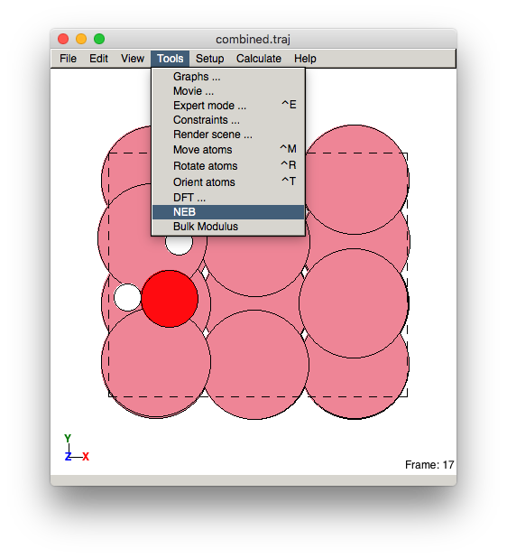
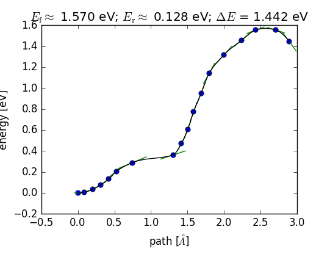

# ASE Tutorials
1. [Introduction to ASE](../)
2. [Getting Started](../Getting_Started/)
3. [Adsorption](../Adsorption/)
4. [Transition States](../Transition_States/)
5. [Error Estimation and Density of States](../BEEF_DOS/)

____

## Transition State and Free Energy Calculations

In this final exercise, you will be calculating the transition state energy for N<sub>2</sub> dissociation using the fixed bond length (FBL) method. The  nudged elastic band (NEB) method can more accurately determine the saddle point for the transition state, but it is more computationally intensive and we won't be using it for this course. You will also be calculating the vibrational modes for the adsorbed species and using the modules within ASE to determine free energies. Finally, you will be putting everything together in order to calculate the reaction rate.


## Contents
2. [Fixed Bond Length Calculation](#fixed-bond-length-calculation)
3. [Vibrational Frequencies and Free Energies](#vibrational-frequencies)
4. [Reaction Rate](#reaction-rate)
5. [Nudged Elastic Band Calculation (Optional)](#nudged-elastic-band-calculation)


### Required Files ###

Obtain the required files by running:

on Sherlock:

```bash
cd $SCRATCH
wget http://chemeng444.github.io/ASE/Transition_States/exercise_3_sherlock.tar
tar -xvf exercise_3_sherlock.tar
```

or on CEES:

```bash
cd ~/$USER
wget http://chemeng444.github.io/ASE/Transition_States/exercise_3_cees.tar
tar -xvf exercise_3_cees.tar
```


This will create a folder called `Exercise_3_Transition_States`.

<a name='fixed-bond-length-calculation'></a>

### Fixed Bond Length Calculation ###

The fixed bond length (FBL) method is a much faster but cruder way to approximate the minimum energy path and determine the transition state energy. It doesn’t require parallelization over different nodes but may not give you the exact transition state. Generally, one could perform a fixed bond length calculation first and determine if a transition state was found (by checking the vibrational modes). If the transition state is poorly described, then a NEB calculation can be performed based on the fixed bond length results as the inputs.

In a FBL calculation, you provide an initial state, then, you iteratively decrease the distance between the two atoms and optimize the geometry of the entire structure while keeping the bond length fixed. This will approximate the minimum energy pathway (MEP) between the initial and final states. Since we are iteratively decreasing the distance, our input in this case would correspond to the *final* state in our N<sub>2</sub> dissociation reaction. We then fix the bond length between the two N\* atoms that are required to come together and form a bond. We are thus calculating the reverse reaction: 2N\* → N<sub>2</sub> + 2\*. Follow the [`fbl.py`](fbl.py) script to determine the transition state for the dissociative adsorption of N<sub>2</sub> on your metal. The script requires an initial state and a specification of the two atoms whose distance is to be fixed (the two N* atoms).

```python
atom1=12
atom2=13
```

Make sure that the two atoms whose bond distance is to be fixed is correct. Since `FixBondLength()` is a constraint, all constraints on the unit cell must be re-specified when setting the constraints. For surfaces:

```python
constraints = [FixBondLength(atom1,atom2)]
mask = [atom.z < 10 for atom in atoms]      # atoms in the structure to be fixed
constraints.append(FixAtoms(mask=mask))
atoms.set_constraint(constraints)
```

or for clusters:

```python
fixatoms = FixAtoms(indices=[atom.index for atom in atoms if atom.symbol in metals])
constraints.append(fixatoms)
```

Then for each fixed N-N distance, a structural relaxation is performed.

**_These settings have already been set for you in the `fbl.py` script. MAKE SURE TO READ THROUGH THE SCRIPT AND FOLLOW THE INSTRUCTIONS._**

To reduce the likelihood of mistakes, we have highlighted the sections needing your input:

```python
#########################################################################################################
#####                                     YOUR SETTINGS HERE                                        #####
#########################################################################################################
```

Make sure to edit the settings in there!

The fixed bond length calculation can continue beyond the final state and start to give you structures with unrealistically high energies. These would not be relevant for the reaction path and you should select only the trajectory images you want to view. To do this, you can combine the `.traj` files from each step first,

```bash
ase-gui i?.traj i??.traj -n -1 -o combined.traj
```

where `ase-gui` will read all files of the form `i?.traj` followed by `i??.traj`, combine their final steps (using `-n -1`), and then write out a combined file called `combined.traj`.

Then, to select the range of images within `combined.traj`, you can use the @ symbol followed by a range, such as:

```bash
ase-gui combined.traj@:22
```

which will display images 1 through 22 within the combined trajectory file. The image range follows Python syntax. Choose the range where you get a clear view of the initial state, transition state, and final state. You can use `ase-gui` to view the reaction coordinate:

<center>
<br>Tools > NEB</center>

Even though the `NEB` menu option was intended for viewing NEB trajectories, it will work for any transition state calculation. You should see a plot that looks like this:

<center><br>
Reaction Coordinate</center>

You should only pay attention to the peak of the plot, which is where the transition state is. The FBL calculation will not necessarily find the final state (in this case, gaseous N<sub>2</sub>), so the final state energy in the plot will not generally be correct.

If the bond length becomes unrealistically short, you will also see large spikes in the total energy towards the end of your calculation. You can safely ignore these images.


**<font color="red">Requirement:</font>** Turn in an image of the transition state and the reaction coordinate.


<a name='vibrational-frequencies'></a>

### Vibrational Frequencies and Free Energies ###

Calculate the vibrational frequencies for transition state and the final state using the [`run_freq.py`](run_freq.py) script. See the [ASE page](https://wiki.fysik.dtu.dk/ase/ase/thermochemistry/thermochemistry.html) for a detailed explanation of how this is implemented. Use `ase-gui` to view the vibrational modes, which are written out as `vib*.traj` files. There should be \\(3N\\) vibrational modes for all adsorbed states, and \\(3N - 1\\) vibrational modes for the transition state.

Since the fixed bond-length method cannot guarantee a solution at the saddle point (the image with the highest energy might not be exactly at the transition state), you may encounter multiple imaginary modes when you calculate the vibrational frequencies. In this case, the following scheme can be used:

* Any adsorbate should have \\(3N\\) non-imaginary vibrational modes
* Transition states should have \\(3N – 1\\) non-imaginary vibrational modes and one imaginary mode
* If there are extra imaginary modes replace < 7 meV with 7 meV

For the gas phase species, we will provide the results for N<sub>2</sub>, H<sub>2</sub>, and NH<sub>3</sub> for you. You calculated the results for N<sub>2</sub> in the last exercise and you can use either your own results or the one provided. These are in the `Gaseous_Molecules\` folder.

**<font color="red">Requirement:</font>** Calculate the vibrational frequencies for:

* Initial state: 2N\*
* Transition state: N-N\*
* Intermediates: N\*, NH\*, NH<sub>2</sub>\*, NH<sub>3</sub>\*,H\*

<a name='reaction-rate'></a>

### Reaction Rate ###

Using the vibrational frequencies associated with initial, final and transition states, evaluate the rate constant of N<sub>2</sub> dissociation on the metal surface and cluster based on harmonic transition state theory (hTST). In addition, evaluate the rate constant based on the Arrhenius relationship by using the free energy associated with the initial, final, and transition states that were directly calculated from ASE Quantum Espresso. For the free energies, use the [`get_ads_free_energy.py`](get_ads_free_energy.py) script for adsorbed states and [`get_gas_free_energy.py`](get_gas_free_energy.py) for N<sub>2</sub>.

To calculate the rate of N<sub>2</sub> dissociation, one can assume that the first step is rate determining and all other steps are in equilibrium. This leads to two reactions:

$$
\begin{align}
\mathrm{N_2} + 2* &\rightarrow 2N*\\
\mathrm{N}* + \frac{3}{2}\mathrm{H}_{2\,\mathrm{(g)}} &\leftrightarrow \mathrm{NH}_{3\,\mathrm{(g)}} + *
\end{align}
$$

The rate constant and equilibrium constants are:

$$
k_1 = \frac{k_\mathrm{B} T}{h} \exp\left(-\frac{G_\mathrm{N-N}}{k_\mathrm{b}T}\right)
$$

For the entire reaction:

$$
K_\mathrm{eq} = \exp\left(-\frac{\Delta G_\mathrm{rxn}}{k_\mathrm{B}T}\right)
$$

and for *only* the second reaction:

$$
K_\mathrm{2} = \exp\left(-\frac{\Delta G_\mathrm{rxn,2}}{k_\mathrm{B}T}\right)
$$

The reaction rate (turnover frequency, TOF) for the entire reaction is then given in a simply analytical form:

$$
\mathrm{TOF} = k_1 P_\mathrm{N_2} \left(1+\frac{P_\mathrm{NH_3}}{K_2 P_\mathrm{H_2}^{1.5}}\right)\left(1 - \frac{P_\mathrm{NH_3}^2}{K_\mathrm{eq}P_\mathrm{H_2}^3 P_\mathrm{N_2}}\right)
$$


**<font color="red">Requirement:</font>** 

* Plot the log of the rate constant versus the inverse temperature.


<a name='nudged-elastic-band-calculation'></a>

### Nudged Elastic Band Calculation (Optional) ###

To perform a nudged elastic band (NEB) calculation, one needs to provide an initial and final state trajectory. A series of "images" between the initial and final states will then be used to determine the minimum energy path. This band of images will be relaxed. For a NEB calculation, you only need to provide the initial and final state and the number of images in between. Go through the [`neb.py`](neb.py) script. Typically 5~7 images between the initial and final states will be sufficient. Intermediate images will be generated using a linear interpretation of the initial and final trajectory. An odd number of images should be chosen so that the one image will be at the transition state. NEB calculations can take a long time, and the [`neb_restart.py`](neb_restart.py) should be used to read in the previous images. You can also start at with k-points to speed up the calculation, and then restart the calculation with higher k-points.

In the `neb.py` file make sure the line specifying the number of nodes.

```python
#SBATCH --nodes=5
```
corresponds to the number of _intermediate_ images. Check that `intermediate_images = 5` matches. 

Both `neb.py` and `neb_restart.py` scripts require the initial and final states of the reaction path to be provided. This is specified in the lines:

```python
initial = io.read('neb0.traj')
final = io.read('neb6.traj')
```

make sure that the trajectory files are in the directory and are named in the same manner. For the `neb_restart.py` script, the initial and final trajectories must be named in the `neb*.traj` format, where `*` is a number. The script will read in all intermediate images based on the number in the initial and final trajectory.

To view all the trajectory files, run the following command

```bash
ase-gui neb*.traj –n -1
```

where all files of the form `neb*.traj` (with * referring to any number of characters) will be opened in ag. The `-n` flag specifies the image within each trajectory file. Since you are optimizing the entire reaction path, each step in the NEB will be stored in each image file. Specifying `-n -1` tells ase-gui to only read the last image of each file (i.e. the most current step).